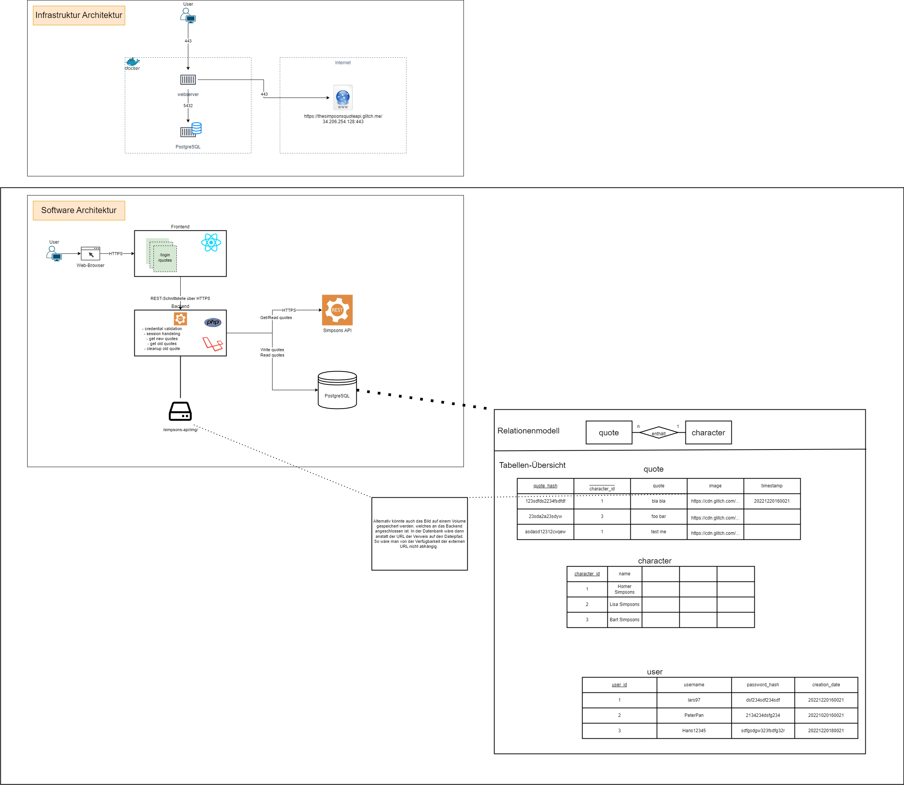

# Hanseatic Bank Code Challenge
- [Aufgaben](#aufgaben)
	- [Aufgabe A - Schaubild](#aufgabe-a---schaubild)
	- [Aufgabe B - Frontend](#aufgabe-b---frontend)
    - [Aufgabe C - Backend 1](#aufgabe-b---backend-1)
    - [Aufgabe D - Backend 2](#aufgabe-d---backend-2)
    - [Aufgabe E - Docker-ImplementierungAufgaben](#aufgabe-e---docker-implementierungaufgaben)

---
Dieses Projekt entstand aus einer Code-Challange von der Alpha Crew.
Die vollständige Umsetzung dieser Aufgabe ist nicht abgeschlossen.

Aktuell wurde kein eigenes Backend angebunden (php + laravel) da der Fokus für mich erstmal auf dem Frontend lag und dieses und React besser zu verstehen.
Anstatt einer Login und Quotes Backend-Schnittstelle wurden Alternativen umgesetzt. Für den Login z.B ein temp. Cookie, welcher einen es ermöglicht ProctectedRoutes aufzurufen.    

<br/><br/>
## Aufgaben

<br/><br/>
### Aufgabe A - Schaubild
#### Architekturen 


<br/><br/>
#### Sequenzdiagramm - Login


<br/><br/>
#### Sequenzdiagramm - Quotes


<br/><br/>
### Aufgabe B - Frontend
### Layout-Idee


<br/><br/>
### Layout-Umsetzung
<center>Login</center>

<center>Quotes</center>


<br/><br/>
### Aufgabe C - Backend 1
### Login Validation
Nicht mit Backend umgesetzt. Stattdessen temporärer und schneller workaround. Nutze beim Login den Nutzer "admin" mit Password "admin". Ein SignUp funktioniert noch nicht. 

<br/><br/>
### Aufgabe D - Backend 2
### Simpsons API
Nicht mit Backend umgesetzt. Aktuell spricht das Frontend die API an und liefert jedes Mal neue 5 Quotes.

<br/><br/>
### Aufgabe E - Docker-ImplementierungAufgaben
1. Repository clonen
```text
git clone https://github.com/LarsFeddern/alpha-challenge.git
```

2. Docker-Compose zum bauen und starten verwenden
```bash
cd alpha-challenge
docker-compose up
```
3. Aufruf des Frontends via Browser unter localhost:80

